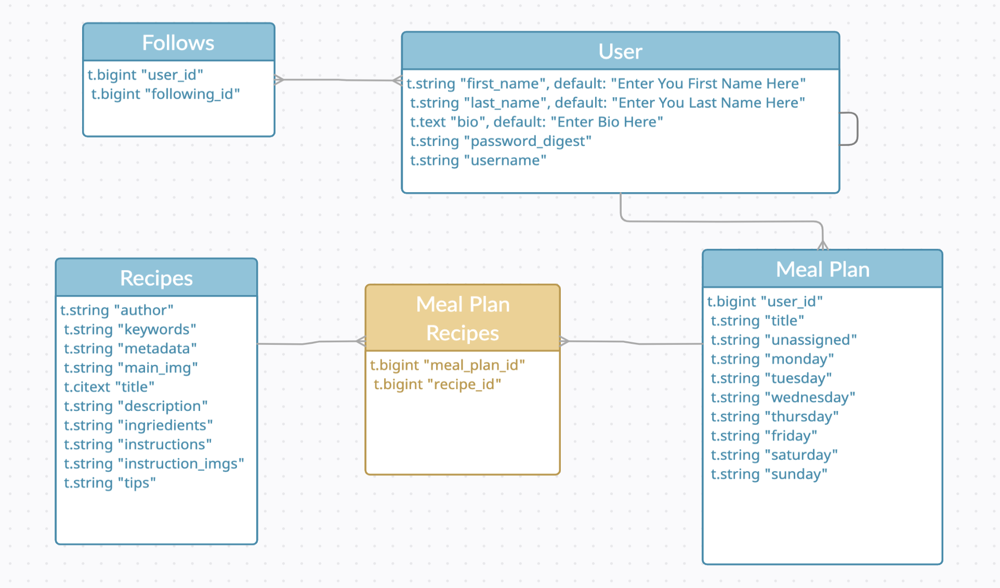
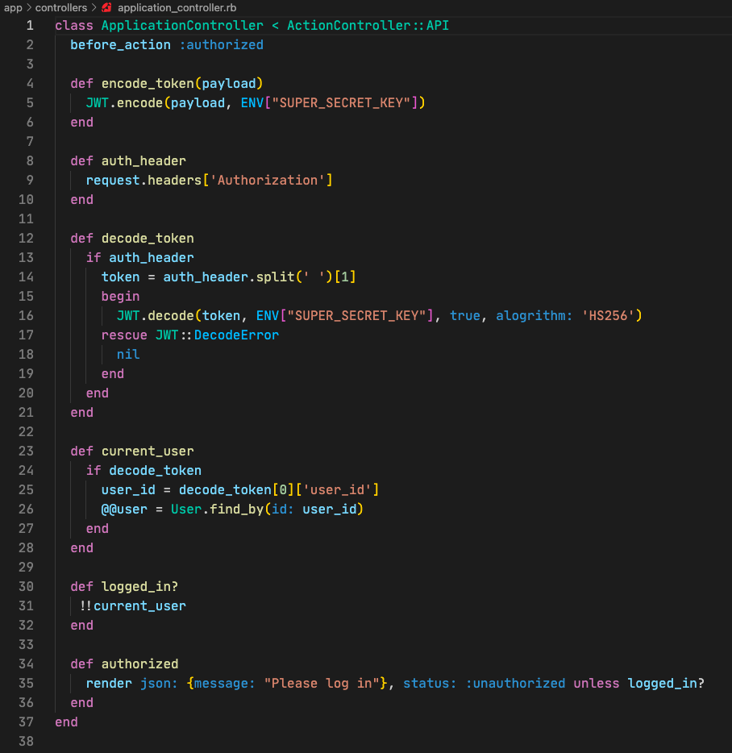
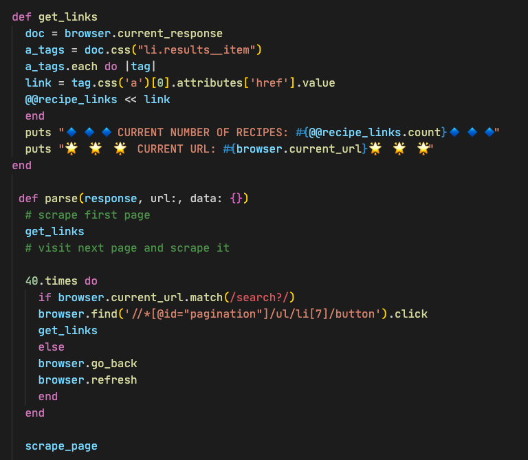

# Flavorites, the Pine Meal Planner

All of the recipes that are seeded in the database are scraped from the Spruce Eats

Find them on their website -> [The Spruce Eats](https://www.thespruceeats.com/) 

This is a rails API that is built to communicate with Flavorites, the Pine Meal Planner React application found here -> 

## Domain Model 

### User
The user manages all of the data that is accossiated with anyone that signs up to use the application. 

### Follows
With the spirit of networking, you can interact with other users in the form of following them. They can also follow your profile, and become a flavor fan. 

### Meal Plan
Each user has the ability to create meal plans. These meal plans have a category for each day of the week and an unassigned category. It is built like this for frontend rendering purposes. Storing the id of the Meal Plan Recipe (Join table) so that it can render them in the correct spot on the calendar. 

### Meal Plan Recipes
Each Meal Plan needs to have many recipes, so we create an instance of where a Meal Plan uses a recipe on this join table. The User also has the information of all the recipes that they are using through Meal Plan. 

### Recipes
These consist of a lot of data scraped from the Spruce Eats website. They should be broken out into different models that correspond with eachother but to preserve their data and respect their creations I am just using this data to model a feature that I would love to help them implement on their site. 

## Authorization and Encryption

We are using Bcrypt to hash and salt user passwords in our database. [^1]

 [^1]: More on [Bcrypt](https://en.wikipedia.org/wiki/Bcrypt)

We are also only allowing interaction with our database if they hold an authorized JWT (JSON WEB TOKEN) [^2]

 [^2]: More on [JWT](https://jwt.io/)

## Web Scraping

Using the Kimurai gem really saved the bacon on this data collection. After struggling with Nokogiri this made collecting dynamic and fun. 

I go to their search page to bulk collect links to individual recipes. With those links I now have new targets for my spider to crawl. I target the content I want on my site and I then loop through collecting a new recipe on each run and creating a new instance of recipe in my database. 

This holds a lot of errors in my database for data sake, but as this is a presentational data it serves its purpose. Common propblem was the main image pictures often collected the author's headshot photo. I sanitize that on the front end with a regex match I correlated to the image url string, which replaces those with a default image to render. 

